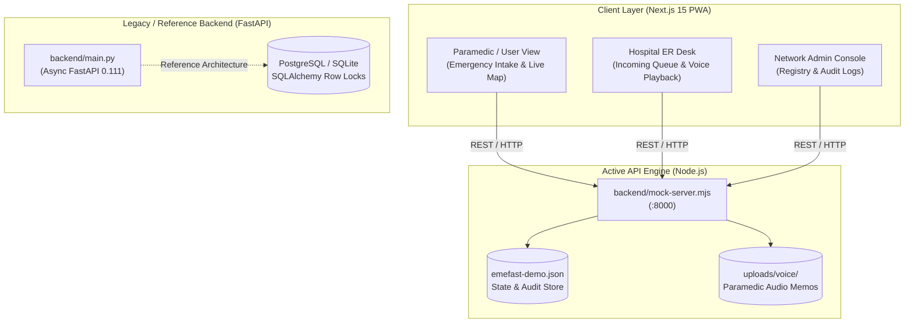

# EMEFast

### Emergency Hospital Coordination Platform

A real-time emergency medical coordination platform designed to instantly query, match, and coordinate with verified hospitals that possess the confirmed clinical capacity to receive critical patients.

> **System Classification**: EMEFast is a **hospital coordination layer**, NOT an ambulance dispatch system. The ambulance navigates; the paramedic, caregiver, or medical operator uses EMEFast to evaluate hospital clinical capability in parallel, broadcast incoming patient acuity, lock critical ICU/trauma resources, and transmit pre-arrival audio telemetry.

[](https://frontend-v2-seven-chi.vercel.app)
[](https://nextjs.org/)
[](https://react.dev/)
[](https://www.typescriptlang.org/)
[](LICENSE)

[**Live Demo**](https://frontend-v2-seven-chi.vercel.app) • [**Architecture Docs**](docs/architecture.md) • [**API Reference**](docs/api.md) • [**Testing Suite**](docs/testing.md) • [**Changelog**](docs/CHANGELOG.md)

---

## Key Features

- **3-Second Hold SOS**: Deliberate 3-second sustained hold trigger with visual progress feedback, pointer capture, and cancellation prevention to eliminate accidental activations.
- **GPS with Accuracy Gate**: Browser device GPS acquisition strictly enforced with a \(\le 100\text{ m}\) accuracy gate. Coarse IP/Wi-Fi approximations are clearly flagged and prevented from opening unverified broadcasts.
- **Voice Audio Telemetry**: Native browser `MediaRecorder` audio memo capture allowing paramedics to record clinical notes en route, automatically uploaded and playable inside the receiving hospital's emergency console.
- **Clinical Capability Matching**: Hard requirement filtering (ICU beds, trauma center, ventilators, pediatric, cardiac, neuro, oxygen availability) evaluated *before* scoring distance, travel time, or estimated costs.
- **Simultaneous Multi-Hospital Query**: Parallel dispatch of emergency requirements to all qualified facilities within the operational radius.
- **Transparent Accept / Reject Workflow**: Real-time hospital evaluation desk. Rejections require mandatory, audited clinical justification reasons.
- **15-Minute Resource Reservation Holds**: Locks requested emergency department trauma beds or ICU units with automatic 15-minute expiration holds to prevent double-booking.
- **Role-Based Workspaces**: Tailored operational interfaces for **Paramedic / User** (rapid triage intake), **Hospital ER Desk** (incoming queue & capacity controls), and **Network Admin** (facility registry & audit telemetry).
- **Resilient Real-Time Sync**: REST polling (1.5s–5s intervals) with automatic backoff, failover retry state machines, and WebSocket fallback compatibility.
- **Progressive Web App (PWA)**: Mobile-optimized standalone shell, iOS/Android safe-area viewports, and local caching.

---

## Architecture

The live web application runs against an active, zero-dependency Node.js coordination engine (`backend/mock-server.mjs`). A full-stack Python/FastAPI reference backend is maintained for multi-tier relational deployment evaluations.



> [!NOTE]
> **Active API vs. Legacy/Reference Backend**  
> - **Active Engine (`backend/mock-server.mjs`)**: Powers the public [Live Demo on Vercel](https://frontend-v2-seven-chi.vercel.app) and local development. It is an in-memory, deterministic coordination server with voice memo storage and capability matching. The public demo API accepts any credentials, does not enforce authentication, and holds only synthetic data.
> - **Legacy / Reference Engine (`backend/main.py`)**: A Python FastAPI reference implementation with SQLAlchemy async models, PostgreSQL row-level reservation locking (`SELECT FOR UPDATE`), and JWT/RBAC authentication. It is preserved for architecture evaluation and migration planning.

---

## Verified Technology Stack

### Frontend Application (`frontend-v2/package.json`)
| Technology | Version | Purpose |
| :--- | :--- | :--- |
| **Next.js** | `^15.5.7` | App Router, SSR, and Static Site Generation |
| **React** | `^19.1.1` | Concurrent UI rendering |
| **TypeScript** | `^5.0.0` | Strict static type checking |
| **Tailwind CSS** | `^3.4.1` | Utility-first styling with Apple-inspired design tokens |
| **Framer Motion** | `^11.18.2` | Fluid animations, gesture tracking, and sheet transitions |
| **Leaflet & OpenStreetMap** | `^1.9.4` | Turn-by-turn road geometry and interactive mapping |
| **Lucide React** | `latest` | Consistent iconography across clinical dashboards |
| **Recharts** | `^2.12.7` | Administrative analytics and hospital admission charts |
| **Axios** | `^1.7.2` | HTTP client with interceptors for error recovery |

### Active API Engine (`backend/mock-server.mjs`)
| Technology | Details | Purpose |
| :--- | :--- | :--- |
| **Node.js Native HTTP** | Native ESM (`node:http`, `node:fs/promises`) | Zero-dependency coordination server |
| **Local File Storage** | Multipart audio upload to `backend/uploads/voice/` | Paramedic voice telemetry storage |
| **State Persistence** | Atomic JSON serialization (`backend/emefast-demo.json`) | Incident lifecycle & audit logging |

### Reference Backend (`backend/requirements.txt`)
| Technology | Version | Purpose |
| :--- | :--- | :--- |
| **FastAPI** | `0.111.0` | Asynchronous REST routing |
| **Uvicorn** | `0.30.1` | ASGI server runtime |
| **SQLAlchemy** | `2.0.30` | Async ORM & row-level locking |
| **Asyncpg / Aiosqlite** | `0.29.0` / `0.20.0` | PostgreSQL and SQLite async database drivers |
| **Pydantic** | `2.7.4` | Request/response data validation schemas |
| **PyJWT & Bcrypt** | `2.8.0` / `4.2.1` | Role-based authentication & password hashing |

---

## Run Locally

The development environment requires **Node.js 20+** and can be run with zero external database configuration.

### 1. Start the Active Coordination API
In your first terminal, start the active mock server:

```bash
node backend/mock-server.mjs
```
*The API will start immediately on `http://localhost:8000`. You can confirm health via `http://localhost:8000/api/health`.*

### 2. Start the Frontend Application
In a second terminal, install frontend dependencies and launch the Next.js development server:

```bash
cd frontend-v2
npm ci
npm run dev
```
*The web client will start on `http://localhost:3001` (or `http://localhost:3000`), pre-configured to query the local API.*

### 3. Open the Application
Navigate to `http://localhost:3001` in your browser. Switch roles via the top navigation bar:
- **Paramedic / User**: Create an incident, trigger 3s SOS, record voice note, view matched hospitals.
- **Hospital ER Desk**: Select a facility (e.g., SMS Hospital), review incoming cases, listen to voice telemetry, and accept or reject with clinical reasons.
- **Network Admin**: View network-wide hospital status, capacity allocation, and system audit logs.

### Demo Accounts
The seeded accounts (`admin@emefast.example`, `hospital-sms@emefast.example`, `ambulance@emefast.example`) are provided solely for public evaluation and demonstration. The live deployment holds no real patient records or personal healthcare data.

### Demo API
The public demo API (`backend/mock-server.mjs`) accepts any credentials, does not enforce authentication, and holds only synthetic data, while the FastAPI code (`backend/main.py`) serves as a reference backend with JWT/RBAC and relational row-level locking.

---

## Prototype Scope & Boundaries

EMEFast is an engineering prototype designed to demonstrate rapid, multi-facility emergency medical coordination. We maintain clear boundaries regarding platform capabilities:

1. **Hospital Coordination, Not Ambulance Dispatch**: The platform coordinates receiving facilities and hospital capacity; it does not replace CAD (Computer-Aided Dispatch) vehicular fleet telemetry or emergency phone lines (108/112).
2. **Explicit Location Truth**: The application strictly respects browser location APIs. It requires explicit user permission and enforces a \(\le 100\text{ m}\) accuracy threshold. Mock coordinates are only used when explicitly requested via developer testing controls; device GPS is never spoofed.
3. **Browser Audio Telemetry**: Voice memos utilize standard browser `MediaRecorder` capabilities and are persisted to the server filesystem for demonstration purposes. Production deployment requires HIPAA/NABH-compliant object storage with encryption at rest and access audit trails.
4. **Resilient Communication**: While WebSocket interfaces are supported, the primary synchronization layer employs active REST polling with exponential backoff to ensure reliable connectivity over degraded mobile networks.

---

## Documentation & References

- [Architecture Specification](docs/architecture.md): System components, data flows, and state machines.
- [API Reference](docs/api.md): Detailed REST endpoint documentation.
- [Database Schema](docs/database.md): Entity-relationship models for the reference PostgreSQL backend.
- [Testing & Verification Guide](docs/testing.md): Automated verification checklist and E2E test suites.
- [Deployment Guide](docs/deployment.md): Instructions for hosting on Vercel and Render.
- [Changelog](docs/CHANGELOG.md): Complete release history and prototype iterations.
- [Security Policy](SECURITY.md): Responsible disclosure and vulnerability reporting guidelines.

---

## License

This project is licensed under the MIT License — see the [LICENSE](LICENSE) file for details.
