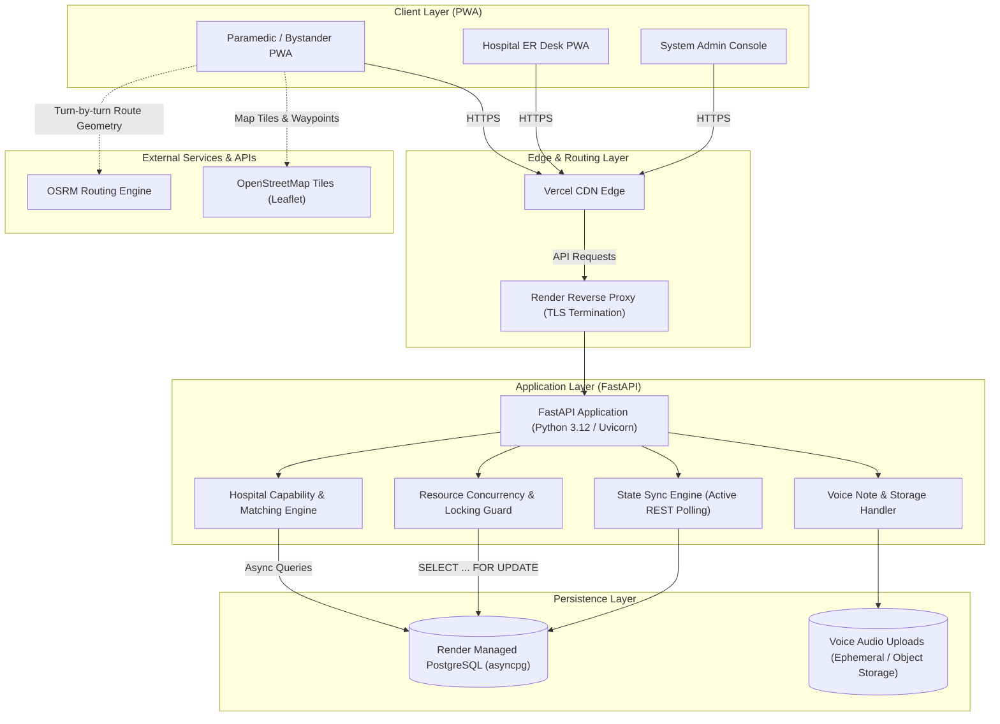
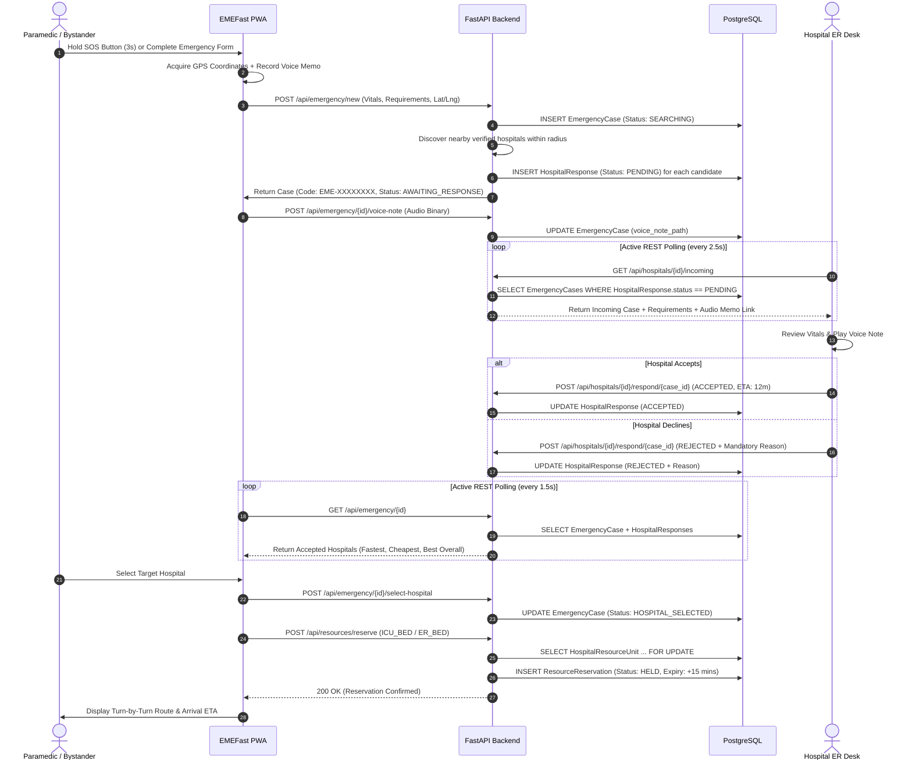
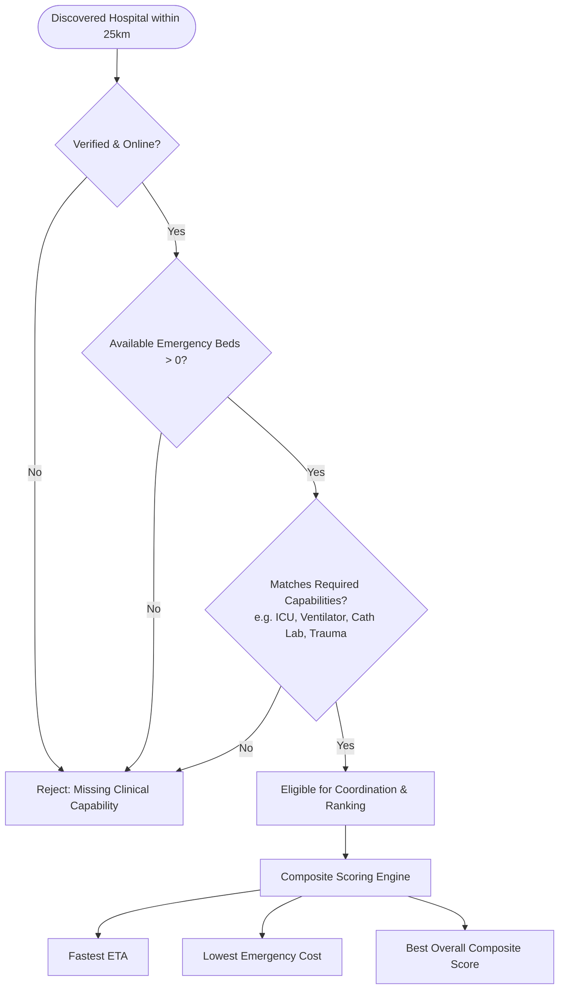

# EMEFast Architecture Specification

## 1. System Overview

**EMEFast** (Emergency Medical Fast Response System) is a real-time emergency coordination platform engineered to bridge the critical gap between pre-hospital emergency care and hospital emergency departments (EDs).

> **CRITICAL ARCHITECTURAL BOUNDARY:**  
> EMEFast is an **Emergency Hospital Coordination Platform**, NOT an ambulance dispatch system. It coordinates ambulances that already exist, connecting the paramedic, medical operator, or bystander directly with capable, verified hospitals. It does not manage municipal vehicle fleets, dispatch 108 drivers, or assign fleet numbers.

---

## 2. High-Level Architecture Diagram

---

## 3. Core Component Breakdown

### 3.1 Frontend (`frontend-v2/`)
- **Framework**: Next.js 15.5 (React 19, App Router).
- **Directory Name Rationale**: Named `frontend-v2` representing the modern Next.js 15 App Router overhaul from the legacy Pages router. Configured in `vercel.json` and root `package.json`.
- **UI Architecture**: Apple Liquid Glass + Lucid Frost dark design system (`#050505` matte black foundation, translucent glass controls, luminous red `#FF3B30` emergency accents).
- **Mapping & Routing**: Client-side Leaflet.js with OpenStreetMap raster tiles, dynamic incident markers, hospital pins, and OSRM (Open Source Routing Machine) road geometry.
- **Voice Memo Pipeline**: Audio capture via native browser `MediaRecorder` API (`audio/webm` or `audio/mp4`), optional dual-language Web Speech transcription (Hindi/English), and direct binary transmission to `/api/emergency/{id}/voice-note`.
- **State Synchronization**: Active REST polling (`setInterval` at 1.5s–5s intervals) across emergency status, incoming hospital query queues, and administrative counters.

### 3.2 Backend (`backend/`)
- **Framework**: FastAPI (Python 3.12) executed under `uvicorn[standard]` workers.
- **Authoritative Target**: All production endpoints are implemented in `backend/routers/`:
  - `emergency.py`: Emergency lifecycle (creation, status tracking, hospital selection, voice note attachment).
  - `hospitals.py`: Hospital discovery, incoming alert queues, and Accept/Decline responses.
  - `resources.py`: Row-level locked ICU/ER resource reservations with automatic 15-minute expiry cleanup.
  - `admin.py`: Hospital verification audits and aggregate coordination metrics.
  - `auth.py`: JWT issuance and bcrypt credential management.
  - `health.py` & `main.py`: Health checks (`/health`, `/api/health`).
- **Backend Architecture Separation**:
  - **Active Coordination Engine**: `backend/mock-server.mjs` (Node.js) powers the live public demo and local development. It operates as an unauthenticated in-memory coordination service with synthetic data.
  - **Reference Backend**: FastAPI (`backend/main.py`) provides the reference architecture with PostgreSQL, async SQLAlchemy row-level locks, and JWT/RBAC.

---

## 4. Emergency Coordination Sequence

---

## 5. Hospital Eligibility & Decision Rules

Hospital ranking strictly enforces clinical eligibility *before* computing distance or cost:

### Recommendation Invariants:
1. A hospital lacking a required capability (e.g. Trauma Surgeon, Pediatric ICU) **cannot** be recommended, regardless of proximity or cost.
2. Clinical capabilities and verified availability are hard **gates**; distance, ETA, and cost are secondary **optimization factors**.
3. All hospital rejections require an explicit, audited reason stored in `hospital_responses.rejection_reason`.

---

## 6. Realtime State Synchronization Model

- **Current Implementation**: Active REST Polling (`setInterval`).
  - Emergency Coordinator View: Polls `/api/emergency/{id}` every **1.5 seconds** while status is `AWAITING_RESPONSE`.
  - Hospital Incoming Queue: Polls `/api/hospitals/{id}/incoming` every **2.5 seconds**.
  - Admin Operations Monitor: Polls `/api/admin/metrics` every **5 seconds**.
- **Architectural Rationale**: REST polling was chosen over WebSockets for prototype resilience across varying mobile network conditions, avoiding state loss during cellular tower handoffs and simplifying deployment across serverless edge infrastructure (Vercel).
- **Future WebSocket Path**: WebSocket connection endpoints (`/ws/emergency/{id}`) are planned for dedicated bidirectional clinical telemetry streaming.

---

## 7. Storage & Persistence Architecture

1. **PostgreSQL Relational Schema**: Authoritative data store on Render for users, hospitals, cases, responses, resource units, and reservations.
2. **Audio Voice Memos**: Stored via a pluggable `VoiceStorage` abstraction (`backend/services/storage.py`), supporting local filesystem storage (`LocalVoiceStorage`) for local development, and S3-compatible cloud object stores (`S3VoiceStorage`) for production (AWS S3, Cloudflare R2, MinIO).
3. **Local Cache / Offline Fallback**: PWA service worker (`public/sw.js`) caches application shells and assets. Incomplete network requests queue locally for synchronization.
