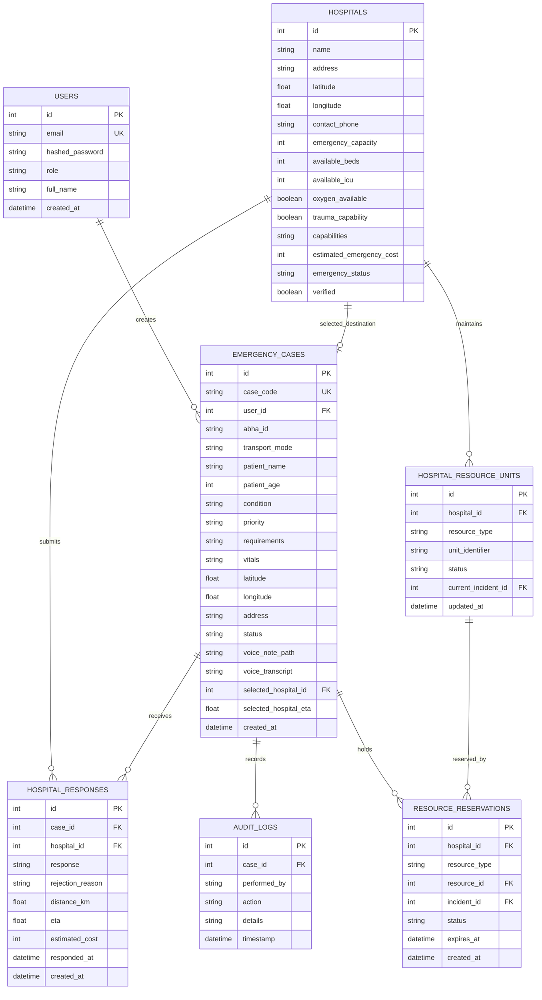

# EMEFast Database Schema & Models

EMEFast uses SQLAlchemy 2.0 with asynchronous drivers (`asyncpg` for PostgreSQL in production and `aiosqlite` for local offline testing).

---

## 1. Entity-Relationship Diagram

---

## 2. Table Specifications

### 2.1 `hospitals`
Stores emergency medical facilities, live bed counts, capabilities, and geographic coordinates.

| Column | Type | Constraints | Description |
| :--- | :--- | :--- | :--- |
| `id` | `INTEGER` | Primary Key, Index | Auto-incrementing identifier |
| `name` | `VARCHAR` | Not Null, Index | Facility name |
| `address` | `VARCHAR` | Not Null | Physical street address |
| `latitude` | `FLOAT` | Not Null | WGS84 decimal latitude |
| `longitude` | `FLOAT` | Not Null | WGS84 decimal longitude |
| `emergency_capacity` | `INTEGER` | Default: 50 | Total emergency department capacity |
| `available_beds` | `INTEGER` | Default: 20 | General available emergency beds |
| `available_icu` | `INTEGER` | Default: 5 | Real-time available ICU beds |
| `oxygen_available` | `BOOLEAN` | Default: True | Piped medical oxygen availability |
| `trauma_capability` | `BOOLEAN` | Default: True | Trauma team availability |
| `capabilities` | `VARCHAR` | Nullable | Comma-separated specialties (e.g. `Cardiology, ICU`) |
| `estimated_emergency_cost`| `INTEGER` | Default: 2500 | Base triage and emergency fee (INR) |
| `emergency_status` | `VARCHAR` | Default: "ONLINE" | Status: `ONLINE`, `DIVERTING`, `FULL` |
| `verified` | `BOOLEAN` | Default: True | System administrator verification flag |

---

### 2.2 `emergency_cases`
Represents an active or historic emergency incident opened by a paramedic or bystander.

| Column | Type | Constraints | Description |
| :--- | :--- | :--- | :--- |
| `id` | `INTEGER` | Primary Key, Index | Unique incident ID |
| `case_code` | `VARCHAR` | Unique, Index | Human-readable case code (e.g. `EME-A231ADEE4E`) |
| `user_id` | `INTEGER` | Foreign Key (`users.id`) | Submitting user ID (optional in demo mode) |
| `abha_id` | `VARCHAR` | Nullable | Ayushman Bharat Health Account ID |
| `transport_mode` | `VARCHAR` | Default: "BYSTANDER" | Transport type (`AMBULANCE`, `BYSTANDER`, `SELF`) |
| `patient_name` | `VARCHAR` | Not Null | Patient name or "Unknown Patient" |
| `patient_age` | `INTEGER` | Nullable | Estimated or known patient age |
| `condition` | `VARCHAR` | Not Null | Primary clinical diagnosis or chief complaint |
| `priority` | `VARCHAR` | Default: "CRITICAL" | Triage category (`CRITICAL`, `URGENT`, `STABLE`) |
| `requirements` | `VARCHAR` | Nullable | Required medical capabilities |
| `vitals` | `VARCHAR` | Nullable | Vital signs summary (BP, HR, SpO2) |
| `latitude` | `FLOAT` | Not Null | Incident location latitude |
| `longitude` | `FLOAT` | Not Null | Incident location longitude |
| `status` | `VARCHAR` | Default: "SEARCHING" | `SEARCHING`, `AWAITING_RESPONSE`, `HOSPITAL_SELECTED` |
| `voice_note_path` | `VARCHAR` | Nullable | Local/bucket path to recorded audio memo |
| `voice_transcript` | `TEXT` | Nullable | Automated speech-to-text transcript |
| `selected_hospital_id` | `INTEGER` | Foreign Key (`hospitals.id`) | Destination hospital chosen by coordinator |
| `selected_hospital_eta` | `FLOAT` | Nullable | Driving ETA in minutes to selected hospital |

---

### 2.3 `hospital_resource_units` & `resource_reservations`
Handles concurrency-safe resource locking for ICU beds, ventilators, and emergency trauma bays.

- **Row-Level Locking**: `SELECT * FROM hospital_resource_units WHERE id = :id FOR UPDATE`
- **Double-Booking Guard**: If `status != 'AVAILABLE'`, the transaction rolls back and emits `HTTP 409 Conflict (RESOURCE_ALREADY_RESERVED)`.
- **15-Minute Auto-Expiry**: Reservations hold a `status = 'HELD'` for 15 minutes (`expires_at = NOW() + 15m`). The cleanup worker restores expired units to `AVAILABLE`.
